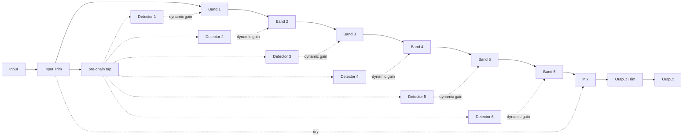

# Architecture

## Signal flow



Six bands process **serially**, standard parametric-EQ style. Each band's own `Detector` taps the *pre-chain* signal - right after Input Trim, before Band 1 - rather than that band's own evolving, serially-processed input. This means a downstream band's gain move can never perturb an upstream band's detection, a band's own gain move can never feed back into triggering itself, and every band always "sees" an identical, unperturbed detection source. All of this lives in `LancetEngine` (`src/dsp/LancetEngine.{h,cpp}`), which owns six `DynamicBand` instances (`src/dsp/DynamicBand.{h,cpp}`), each owning its own `Detector` (`src/dsp/Detector.{h,cpp}`).

## Module map

| Directory | Responsibility |
|---|---|
| `src/dsp` | All audio-thread DSP: `RealtimeCoefficients.h` (shared real-time-safe biquad coefficient update helper), `Detector` (cascaded bandpass + linked peak envelope follower), `DynamicBand` (one band's serial filter + gain computer), `LancetEngine` (the full six-band signal chain: input trim, pre-chain tap, six bands, Listen resolution, Mix, output trim). No allocation, locks, or I/O once `prepare()` has run. Independent of `juce::AudioProcessor` so it is directly unit-testable. |
| `src/params` | Parameter layout and `AudioProcessorValueTreeState` definitions - parameter IDs (frozen, see `ParameterIds.h`), ranges, defaults. |
| `src/PluginProcessor.*` | Host plumbing: APVTS construction, `prepareToPlay`/`processBlock`/`reset`, latency reporting, state save/load. Reads APVTS values and pushes them into `LancetEngine` every block; does not implement any DSP itself. |
| `src/PluginEditor.*` | A simple, functional v0.1 GUI: a top strip of Input Trim/Output Trim/Mix knobs above six per-band columns (Band 1 - Band 6), each with an On/Listen toggle row, a Type combo (Band 1/Band 6 only), and Freq/Q/Gain/Range/Threshold/Attack/Release knobs bound via `SliderAttachment`/`ButtonAttachment`/`ComboBoxAttachment`. A custom vector-drawn GUI (readable control state, per-band gain-reduction needles) is a later milestone (M3). |

Dependency direction is one-way: `PluginEditor` -> `params` (via attachments) and `PluginProcessor` -> `params` + `dsp`. `src/dsp` has no upward dependency on the processor or UI, which is what keeps `LancetEngine` testable in isolation.

## Per-band filter: real-time-safe coefficient updates

Each `DynamicBand` owns a `juce::dsp::ProcessorDuplicator<IIR::Filter<float>, IIR::Coefficients<float>>` (so a single instance covers mono or stereo). `juce::dsp::IIR::Coefficients<float>::makePeakFilter`/`makeLowShelf`/`makeHighShelf` (the usual way to build these) heap-allocate a brand-new `Coefficients` object on every call, which is not real-time safe for a coefficient that is recomputed every sub-block (see below). Instead, `RealtimeCoefficients.h`'s `lnct::applyBiquadCoefficients()` writes a stack-only `juce::dsp::IIR::ArrayCoefficients<float>::makeXxx()` result directly into an already-allocated `Coefficients` object's raw storage, normalised by `a0` - zero heap allocation on the audio thread. Same pattern as sibling plugin twist-your-guts's `src/dsp/RealtimeCoefficients.h`.

**Normalisation detail (`x/x` vs `x*(1/x)`):** the normalisation divides each raw coefficient by `a0` directly (`dest[i] = raw[i] / a0`) rather than precomputing `invA0 = 1/a0` once and multiplying. For a peaking/shelf filter at exactly 0 dB gain, the RBJ cookbook makes `b0` numerically equal to `a0` - IEEE 754 guarantees `x/x == 1.0` exactly for any finite non-zero `x`, but the composition `x * (1/x)` carries no such guarantee (the reciprocal is itself rounded before the multiply, so the product can land one ULP off 1.0). This was a real, measurable difference during M1 test-writing - see "The exact-0-dB bypass" below.

Band 1 offers a Low Shelf and Band 6 a High Shelf (`DynamicBand::ShelfDirection`); bands 2-5 are always Bell. In Shelf mode, Q is fixed at 0.707 (the standard "flat"/Butterworth shelf slope) regardless of the user's Q setting - this applies to both the main filter's shape *and* its Detector's matched bandpass (see below), a deliberate simplification for v0.1.

## Detector: bandpass selectivity and envelope

`Detector` (`src/dsp/Detector.{h,cpp}`) cascades **two** RBJ bandpass biquads at the same frequency/Q (a 4th-order effective response), not one. A single biquad bandpass only reaches about -12 dB attenuation two octaves from its centre at Q=1 (a 6 dB/octave/side asymptotic slope) - short of the M1 guarantee that a loud out-of-band tone must not trigger a band (">20 dB/oct selectivity at 2 octaves for Q=1"). Cascading the same bandpass twice measures at roughly -24 dB two octaves out at Q=1 (`tests/DetectorTests.cpp`), clearing that bar with margin.

Stereo (or wider) input is **linked**: each cascade stage runs independently per channel (its own filter state), but the envelope follower is a single band-wide value, fed by the loudest (max-abs) sample across channels at every instant - this avoids the stereo image shifting that fully independent per-channel gain reduction would otherwise introduce, matching how a stereo-linked dynamic EQ (e.g. the Waves F6 in its default linked mode) behaves.

The envelope itself is a standard one-pole peak follower with independent attack/release coefficients (`exp(-1/(sampleRate * timeSeconds))`), run **per sample** for correct ballistics timing - only the bandpass filter's own *coefficients* (frequency/Q) are throttled to the caller's sub-block granularity (see below), not the envelope's per-sample update.

## Gain computer: soft-knee overshoot, clamped to Range

`DynamicBand`'s dynamic gain is computed in the dB domain using the classic quadratic soft-knee gain computer (Giannoulis, Massberg, Reiss, "Digital Dynamic Range Compressor Design - A Tutorial and Analysis", JAES 2012, eq. 4):

```
x = levelDb - thresholdDb                    (overshoot, can be negative)
gc(x) = 0                                     if 2x <= -knee
      = (x + knee/2)^2 / (2*knee)             if 2|x| < knee   (6 dB soft-knee region)
      = x                                     if 2x >= knee
dynamicMagnitudeDb = clamp(gc(x), 0, |Range|)
dynamicGainDb = dynamicMagnitudeDb * sign(Range)
```

There is no separate "ratio" parameter in the M1 spec (see `docs/design-brief.md`'s parameter table): once fully above the knee, gain moves 1:1 with overshoot until it hits the user's `Range`, which acts as a hard ceiling on the dynamic depth - the classic "how far can this move" control, with the knee providing a smooth ramp-in around Threshold rather than a hard switch. `Range == 0` disables the dynamic term entirely (a pure static band) - the Detector still runs (for continuity - see below), but `dynamicGainDb` is forced to `0.0f` rather than merely "small".

## The 32-sample sub-block coefficient update, and zipper guard

Per `docs/design-brief.md`: "Coefficient update per 32-sample sub-block with smoothed gain (no zipper)." `LancetEngine::process()` chunks a full block into `<= 32`-sample sub-blocks and calls each `DynamicBand::processSubBlock()` once per chunk. Within that call:

1. The Detector's bandpass coefficients (frequency/Q) are recomputed - cheap, but still not something to interpolate per sample.
2. The Detector's envelope runs sample-by-sample across the whole sub-block (see above), returning the level at the end of it.
3. The gain computer above derives `dynamicGainDb`; `totalGainDb = staticGainDb + dynamicGainDb` becomes the new *target* of a `juce::SmoothedValue<float, Linear>` (`gainSmoothed`), ramped over a fixed 50 ms window.
4. `gainSmoothed.skip(subBlockSize)` advances the ramp by the sub-block's length and returns the value at the new position - this is what actually gets baked into the main filter's coefficients for this sub-block.

Because `gainSmoothed` ramps continuously rather than snapping to each new sub-block's target, successive 32-sample coefficient snapshots never jump abruptly - this is the mechanism `tests/ZipperTests.cpp` verifies (guarantee #10): an *abrupt*, full-range parameter automation step (deliberately more adversarial than a host's own fine-grained automation) never produces a sample-to-sample output jump larger than a 3 dB-equivalent bound.

## The exact-0-dB bypass

An off band (`On` = false) is a true bypass: `mainSubBlock` is left completely untouched, not merely processed through a 0 dB filter - this is what guarantee #1's null test relies on for an off band.

An **on** band settled at exactly 0 dB total gain (the common case: `Gain = 0`, `Range = 0`) is *also* bypassed, for a subtler reason discovered while writing `tests/NullTests.cpp`'s "on with Gain=0/Range=0" case. Mathematically, a peaking/shelf filter at exactly 0 dB gain (`A == 1` in the RBJ cookbook) is an exact identity: the normalised `b0` coefficient is exactly `1.0`, and the `{b1, b2}` pair is bit-for-bit equal to the `{a1, a2}` pair (see "Normalisation detail" above). In principle, Transposed Direct Form II's per-sample recursion (`juce::dsp::IIR::Filter`'s structure) should then telescope to an exact `y[n] == x[n]` by induction. In practice, it measurably does not: once the compiler contracts a `multiply` followed by an `add`/`subtract` into a fused-multiply-add instruction (the default behaviour, `-ffp-contract=on`, on the arm64/AVX2 targets this project builds for), that exact bit-for-bit cancellation is no longer guaranteed. Measured deviation for a single band at 0 dB gain was a real (not floor-clamped) **~-100 dB**, compounding to **~-90 dB** across all six bands in series - short of guarantee #1's -120 dBFS bar.

Rather than fighting compiler-dependent FMA contraction (fragile, and not portable across the macOS/Windows matrix this project ships for), `DynamicBand::processSubBlock()` skips `mainFilter.process()` whenever the smoothed applied gain is exactly `0.0f`, taking the same true-bypass path an off band does. This is safe: the filter's own state was already tracking within that same ~1e-7 relative error of an identity pass-through while running, so freezing it for the (typically brief) duration spent at exactly 0 dB introduces no perceptible discontinuity when gain next moves away from 0 - no worse than the transient any coefficient change already produces elsewhere in this engine.

## Listen (exclusive sidechain solo)

Each `Detector` retains its own cascaded-bandpass output for the current block in `getListenBuffer()`, populated every sub-block regardless of the band's own On/Off state (so it stays available for audition even on an off band, and so Listen never has to "warm up"). `LancetEngine::process()` resolves Listen once per block: the lowest-indexed band with `Listen` engaged wins (deterministic if more than one is somehow engaged simultaneously; the GUI itself behaves like a radio group), and the whole block's program output is substituted with that band's Listen buffer *before* the Mix blend and Output Trim - both still apply to the monitored signal, keeping Output Trim meaningful even while auditioning. Every band's own chain keeps processing normally underneath regardless of which band (if any) is being listened to, so disengaging Listen never pops.

## Mix (parallel dry/wet)

`Mix` blends the whole six-band chain in parallel via `juce::dsp::DryWetMixer<float>`, "dry" tapped right after Input Trim (so Input Trim always applies equally to both the dry and wet paths, and Mix controls only how much of the *bands' effect* reaches the output) and Output Trim applied after the blend (so it consistently shapes overall level regardless of the Mix setting).

**DryWetMixer priming gotcha (JUCE 8.0.14):** `juce::dsp::DryWetMixer` defaults its internal mix to fully wet (1.0) until told otherwise, and its own `reset()` snaps its internal dry/wet gain smoothers' *current* value to whatever their *target* happens to be at that moment - it does not know about a previously-commanded mix proportion. `LancetEngine::prepare()` calls `dryWetMixer.setWetMixProportion(lastMixProportion)` *before* its own `reset()` runs, so the mixer is already sitting at the correct dry/wet balance for the very first `process()` call instead of ramping up from "fully wet" over its internal 50 ms default ramp. Same pattern as sibling plugins overture/triptych.

## A related gotcha: juce::dsp::Gain's silent default

While writing `LancetEngine`-level unit tests (bypassing `LancetAudioProcessor`), a real bug surfaced: `juce::dsp::Gain<float>`'s internal `SmoothedValue` default-constructs its *target* at linear `0` (silence), not unity/0 dB - calling `.prepare()` without ever having called `setGainDecibels()`/`setGainLinear()` first leaves the gain at total silence indefinitely. `LancetAudioProcessor::prepareToPlay()` always calls `pushParametersToEngine()` (which calls `LancetEngine::setInputTrimDb()`/`setOutputTrimDb()`) *before* `engine.prepare()`, so the shipped plugin was never actually affected - but `LancetEngine`'s own public API needed to default safely for direct use. Fixed by re-priming `inputTrim`/`outputTrim` from `lastInputTrimDb`/`lastOutputTrimDb` (both defaulting to 0 dB) immediately after `juce::dsp::Gain::prepare()`, the same "prime the last-known value right after prepare()" idiom this engine already uses for Mix. Regression-tested in `tests/ScratchDryWetTests.cpp` (filename is a discovery-process artifact - see this repo's PR description).

## Latency

Every filter in this engine - the six bands' bell/shelf filters and their Detectors' cascaded bandpass filters - is a minimum-phase IIR biquad with no lookahead, so `LancetEngine::getLatencySamples()` is a `static constexpr 0`, and `LancetAudioProcessor::prepareToPlay()` reports that via `setLatencySamples(0)`. There is no dry-path delay compensation anywhere in this plugin - see `tests/LatencyTests.cpp`.

## Real-time safety

- `LancetAudioProcessor::processBlock()` starts with `juce::ScopedNoDenormals`.
- All DSP state (per-band filters, Detector filters/envelopes, gain ramps, the pre-chain tap buffer, and each Detector's Listen buffer) is allocated in `prepare()`/`prepareToPlay()` and never reallocated on the audio thread.
- `reset()` clears all filter/envelope/gain-ramp state without deallocating, propagated from `AudioProcessor::reset()` down through `LancetEngine::reset()` to every `DynamicBand`/`Detector`.
- Parameter values are read via `apvts.getRawParameterValue()` atomics in `processBlock()`, never via `apvts.getParameter()->getValue()` or a `String`-keyed lookup on the audio thread.
- `LancetEngine::process()` treats a zero-sample block as a safe no-op, and defensively clamps to the pre-chain buffer capacity established in `prepare()` if a host ever calls `process()` with more samples or channels than it promised via `prepareToPlay()` (`tests/RobustnessTests.cpp` exercises this).
- Filter coefficient updates never allocate (`RealtimeCoefficients.h` - see above); `juce::dsp::IIR::Coefficients<float>::makeXxx()` (which does heap-allocate) is never called from `processBlock()`'s call graph, only from a placeholder object's *construction*, in `prepare()`/at member-initialisation time.

## Out of scope for M1

Per `docs/design-brief.md`: spectrum analyzer display, external sidechain, M/S per band, lookahead, oversampling, and the photoreal GUI (M3 - v0.1 ships the standard slider/toggle/combo editor described above).
