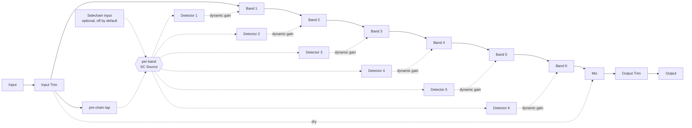

# Architecture

## Signal flow


```mermaid
flowchart LR
    IN[Input] --> TRIM_IN[Input Trim]
    SC[Sidechain input<br/>optional, off by default] -.-> SEL{{per-band<br/>SC Source}}
    TRIM_IN --> PRECHAIN[pre-chain tap]
    PRECHAIN -.-> SEL
    TRIM_IN --> B1[Band 1]
    B1 --> B2[Band 2]
    B2 --> B3[Band 3]
    B3 --> B4[Band 4]
    B4 --> B5[Band 5]
    B5 --> B6[Band 6]
    SEL -.-> D1[Detector 1]
    SEL -.-> D2[Detector 2]
    SEL -.-> D3[Detector 3]
    SEL -.-> D4[Detector 4]
    SEL -.-> D5[Detector 5]
    SEL -.-> D6[Detector 6]
    D1 -.->|dynamic gain| B1
    D2 -.->|dynamic gain| B2
    D3 -.->|dynamic gain| B3
    D4 -.->|dynamic gain| B4
    D5 -.->|dynamic gain| B5
    D6 -.->|dynamic gain| B6
    B6 --> MIX[Mix]
    TRIM_IN -.->|dry| MIX
    MIX --> TRIM_OUT[Output Trim]
    TRIM_OUT --> OUT[Output]
```

Six bands process **serially**, standard parametric-EQ style. Each band's own `Detector` taps the *pre-chain* signal - right after Input Trim, before Band 1 - rather than that band's own evolving, serially-processed input. This means a downstream band's gain move can never perturb an upstream band's detection, a band's own gain move can never feed back into triggering itself, and every band always "sees" an identical, unperturbed detection source. All of this lives in `LancetEngine` (`src/dsp/LancetEngine.{h,cpp}`), which owns six `DynamicBand` instances (`src/dsp/DynamicBand.{h,cpp}`), each owning its own `Detector` (`src/dsp/Detector.{h,cpp}`).

Since v0.4.0 a band may instead take its detection from the plugin's optional external sidechain bus (per-band **SC Source**), and may listen to the whole spectrum rather than just its own region (per-band **SC Mode**) - see "external sidechain and Split/Wide detection" below. Both default to the pre-v0.4.0 routing, and a band set to External falls back to the pre-chain tap whenever the host provides no sidechain.

## Module map

| Directory | Responsibility |
|---|---|
| `src/dsp` | All audio-thread DSP: `TptSvf.h` (free-standing trapezoidal state-variable filter - bell/low shelf/high shelf, per-sample gain API), `AdaaTanh.h` (antiderivative-antialiased tanh kernel, one state per channel), `RealtimeCoefficients.h` (shared real-time-safe biquad coefficient update helper, used by the Detector's bandpass), `Detector` (cascaded bandpass + linked peak envelope follower, Split/Wide), `DynamicBand` (one band's filter + per-sample gain computer + saturator), `LancetEngine` (the full six-band signal chain: input trim, pre-chain tap, sidechain routing, six bands, Listen resolution, Mix, output trim). No allocation, locks, or I/O once `prepare()` has run. Independent of `juce::AudioProcessor` so it is directly unit-testable. `TptSvf.h` and `AdaaTanh.h` are deliberately free-standing - the planned spectral-suppression module needs the SVF as its filter-bank primitive and should not have to drag the dynamics engine along. |
| `src/params` | Parameter layout and `AudioProcessorValueTreeState` definitions - parameter IDs (frozen, see `ParameterIds.h`), ranges, defaults. |
| `src/PluginProcessor.*` | Host plumbing: APVTS construction, `prepareToPlay`/`processBlock`/`reset`, latency reporting, state save/load. Reads APVTS values and pushes them into `LancetEngine` every block; does not implement any DSP itself. |
| `src/PluginEditor.*` | A simple, functional v0.1 GUI: a top strip of Input Trim/Output Trim/Mix knobs above six per-band columns (Band 1 - Band 6), each with an On/Listen toggle row, a Type combo (Band 1/Band 6 only), SC Source and SC Mode combos (v0.4.0), and Freq/Q/Gain/Range/Threshold/Attack/Release knobs bound via `SliderAttachment`/`ButtonAttachment`/`ComboBoxAttachment`. Note that `ComboBoxAttachment` binds a selection to a parameter index but does *not* populate the box - every combo has its items added explicitly first. A custom vector-drawn GUI (readable control state, per-band gain-reduction needles) is a later milestone (M3). |

Dependency direction is one-way: `PluginEditor` -> `params` (via attachments) and `PluginProcessor` -> `params` + `dsp`. `src/dsp` has no upward dependency on the processor or UI, which is what keeps `LancetEngine` testable in isolation.

## Per-band filter: the trapezoidal SVF core (v0.4.0)

Since v0.4.0 each `DynamicBand` realises its bell/shelf through `lnct::TptSvf`
(`src/dsp/TptSvf.h`), a topology-preserving-transform (trapezoidal-integration)
state-variable filter, rather than an RBJ biquad whose coefficients were
rebuilt once per sub-block.

The reason is the ballistics rework described under "v0.4.0: the per-sample
gain path" below. A direct-form biquad whose `{b, a}` coefficients jump every
sample is not a well-defined time-varying filter - its internal state means
something different after each jump, which is precisely what produces zipper
noise, and which is why v0.1-v0.3 needed a 50 ms gain smoother in front of it.
A TPT SVF does not have that problem: its state variables are the two
integrator outputs, which keep their physical meaning no matter how the
coefficients move, so the gain can be modulated per sample by a continuous
control signal without artefact.

**The realised transfer function is identical to the RBJ biquad it replaces.**
Sketch for the bell, with `s` normalised to `w0` and the SVF outputs
`LP = 1/(s^2+ks+1)`, `BP = s/(s^2+ks+1)`:

```
y = x + m1*BP        =>  H(s) = (s^2 + (k+m1)s + 1) / (s^2 + ks + 1)
k = 1/(Q*A), m1 = k*(A^2-1)  =>  k + m1 = A/Q
                     =>  H(s) = (s^2 + (A/Q)s + 1) / (s^2 + (1/(A*Q))s + 1)
```

which is exactly RBJ's peaking-EQ analogue prototype, and the trapezoidal
(bilinear) map with the pre-warp `g = tan(pi*f0/fs)` is the same bilinear map
RBJ's `alpha = sin(w0)/(2Q)` encodes, since `g/(1+g^2) == sin(w0)/2`. The two
shelf forms follow the same argument with `g` additionally scaled by
`1/sqrt(A)` resp. `sqrt(A)`, which is the frequency scaling in RBJ's shelf
prototypes. `tests/NullTests.cpp` pins this against an independent
double-precision RBJ reference (peak residual better than -100 dBFS over 10 s
of noise per setting, worst-conditioned corner included), and
`tests/StaticResponseTests.cpp` against the analytic magnitude response to
±0.05 dB. Existing static EQ settings therefore keep exactly the curve they
had. Discretisation follows Andrew Simper's Cytomic technical paper, implemented
from the published equations - no third-party code is vendored.

**Precision:** the integrator state and per-sample update are kept in `double`
even though the audio interface is `float`. The trapezoidal update contains
the deliberate cancellation `ic1 = 2*v1 - ic1`, which at low frequencies
(`g ~ 1e-3` at 20 Hz/48 kHz) and high Q loses several digits in single
precision - and this filter is modulated per sample, so the error does not
average out.

**Bit-transparency at 0 dB is now structural rather than special-cased.** At
`A == 1` every gain-dependent mix scalar is *exactly* zero (bell: `m1 =
k*(A^2-1)`; low shelf: `m1 = k*(A-1)`, `m2 = A^2-1`; high shelf: `m0 = A^2 = 1`,
`m1 = k*(1-A)*A`, `m2 = 1-A^2`), so `processSample()` returns its input
bit-for-bit without any branch. See "The exact-0-dB bypass" below for what
this replaced.

The Detector's own bandpass is still an RBJ biquad, and still uses the
real-time-safe coefficient path described next.

## Detector bandpass: real-time-safe coefficient updates

The Detector owns `juce::dsp::IIR::Filter<float>` stages sharing one
`Coefficients` object. `juce::dsp::IIR::Coefficients<float>::makeBandPass<IIR::Filter<float>, IIR::Coefficients<float>>` (so a single instance covers mono or stereo). `juce::dsp::IIR::Coefficients<float>::makePeakFilter`/`makeLowShelf`/`makeHighShelf` (the usual way to build these) heap-allocates a brand-new `Coefficients` object on every call, which is not real-time safe for a coefficient that can be recomputed every sub-block. Instead, `RealtimeCoefficients.h`'s `lnct::applyBiquadCoefficients()` writes a stack-only `juce::dsp::IIR::ArrayCoefficients<float>::makeXxx()` result directly into an already-allocated `Coefficients` object's raw storage, normalised by `a0` - zero heap allocation on the audio thread. Same pattern as sibling plugin twist-your-guts's `src/dsp/RealtimeCoefficients.h`.

Since v0.4.0 this recompute is additionally **dirty-flagged**: it only runs when the smoothed frequency or Q have actually moved past an epsilon, instead of unconditionally every sub-block. A band whose frequency/Q are not being automated does no trigonometric work at all, and the per-sample SVF scalars are memoised on an exact gain match, so a band sitting at a settled gain recomputes nothing.

**Normalisation detail (`x/x` vs `x*(1/x)`):** the normalisation divides each raw coefficient by `a0` directly (`dest[i] = raw[i] / a0`) rather than precomputing `invA0 = 1/a0` once and multiplying. For a peaking/shelf filter at exactly 0 dB gain, the RBJ cookbook makes `b0` numerically equal to `a0` - IEEE 754 guarantees `x/x == 1.0` exactly for any finite non-zero `x`, but the composition `x * (1/x)` carries no such guarantee (the reciprocal is itself rounded before the multiply, so the product can land one ULP off 1.0). This was a real, measurable difference during M1 test-writing - see "The exact-0-dB bypass" below.

Band 1 offers a Low Shelf and Band 6 a High Shelf (`DynamicBand::ShelfDirection`); bands 2-5 are always Bell. In Shelf mode, Q is fixed at 0.707 (the standard "flat"/Butterworth shelf slope) regardless of the user's Q setting - this applies to both the main filter's shape *and* its Detector's matched bandpass (see below), a deliberate simplification for v0.1.

## Detector: bandpass selectivity and envelope

`Detector` (`src/dsp/Detector.{h,cpp}`) cascades **two** RBJ bandpass biquads at the same frequency/Q (a 4th-order effective response), not one. A single biquad bandpass only reaches about -12 dB attenuation two octaves from its centre at Q=1 (a 6 dB/octave/side asymptotic slope) - short of the M1 guarantee that a loud out-of-band tone must not trigger a band (">20 dB/oct selectivity at 2 octaves for Q=1"). Cascading the same bandpass twice measures at roughly -24 dB two octaves out at Q=1 (`tests/DetectorTests.cpp`), clearing that bar with margin.

Stereo (or wider) input is **linked**: each cascade stage runs independently per channel (its own filter state), but the envelope follower is a single band-wide value, fed by the loudest (max-abs) sample across channels at every instant - this avoids the stereo image shifting that fully independent per-channel gain reduction would otherwise introduce, matching how a stereo-linked dynamic EQ (e.g. the Waves F6 in its default linked mode) behaves.

The envelope itself is a standard one-pole peak follower with independent attack/release coefficients (`exp(-1/(sampleRate * timeSeconds))`), run **per sample** for correct ballistics timing - only the bandpass filter's own *coefficients* (frequency/Q) are throttled to the caller's sub-block granularity (see below), not the envelope's per-sample update.

## Gain computer: soft-knee overshoot, clamped to Range

`DynamicBand`'s dynamic gain is computed in the dB domain using the classic quadratic soft-knee gain computer (Giannoulis, Massberg, Reiss, "Digital Dynamic Range Compressor Design - A Tutorial and Analysis", JAES 2012, eq. 4):

```
x = levelDb - thresholdDb                    (overshoot, can be negative)
gc(x) = 0                                     if 2x <= -knee
      = (x + knee/2)^2 / (2*knee)             if 2|x| < knee   (6 dB soft-knee region)
      = x                                     if 2x >= knee
dynamicMagnitudeDb = clamp(gc(x), 0, |Range|)
dynamicGainDb = dynamicMagnitudeDb * sign(Range)
```

There is no separate "ratio" parameter in the M1 spec (see `docs/design-brief.md`'s parameter table): once fully above the knee, gain moves 1:1 with overshoot until it hits the user's `Range`, which acts as a hard ceiling on the dynamic depth - the classic "how far can this move" control, with the knee providing a smooth ramp-in around Threshold rather than a hard switch. `Range == 0` disables the dynamic term entirely (a pure static band) - the Detector still runs (for continuity - see below), but `dynamicGainDb` is forced to `0.0f` rather than merely "small".

### v0.2.0: knee width derived from Range

The `knee` above was a flat 6 dB constant pre-v0.2.0. It is now
`DynamicBand::computeKneeWidthDb()`: `clamp(|rangeDb| * 0.5, 2, 10)` dB -
see `docs/design-brief.md` §3 for the sourced rationale (TDR Nova's
documented ratio-coupled-knee principle) and honesty notes on the formula
itself being this brief's own invention, calibrated so the old fixed 6 dB
is reproduced exactly at Range = ±12 dB. `tests/KneeWidthTests.cpp`
measures the actual gain-vs-overshoot curve (not just the formula) at three
Range values via a steady-state RMS-ratio technique, first calibrating out
the Detector's own small, real, and otherwise-expected peak-detector
insertion loss (see `tests/DetectorTests.cpp`'s own tolerance on this) so
the measurement compares against the gain computer's true internal
overshoot rather than the raw input signal's nominal dBFS.

### Threshold defaults: calibrated to a measured programme anchor (issue #4)

The per-band *default* Threshold values are not aesthetic spread: each equals
that band's own measured detector level under a -18 dBFS RMS band-limited
pink-noise anchor, rounded to 1 dB, so every band's dynamic move begins
engaging at the same programme loudness out of the box. The measurement
exploits a structural property of this architecture: the detector bandpass is
constant-Q and pink noise has equal energy per octave, so all six bands
settle at ≈ -24 dBFS under the anchor regardless of centre frequency. Full
reasoning, the old-vs-measured-vs-new table, and honesty notes in
`docs/voicing-notes.md` (Addendum); frozen as a live measurement (not a
constant table) by `tests/ThresholdCalibrationTests.cpp`. The control *laws*
(log Freq/Attack/Release mappings, the Q skew) were analysed in the same
pass, confirmed rather than changed, and are pinned by
`tests/ControlLawTests.cpp` — a mapping change would silently re-curve
existing host automation lanes, which is exactly why the still-deferred
Range/Q range widening waits for a state-schema bump.

### v0.2.0: gain/Q coupling

`bN_gainQ` (opt-in, off by default) widens the *main filter's* own
effective Q as the band's *dynamic* gain approaches Range -
`DynamicBand::computeMainFilterQ()`: `baseQ * lerp(1.0, gainQMinMultiplier=0.4, |dynamicGainDb| / |Range|)`,
evaluated fresh every sub-block from the *instantaneous* (pre-smoothing)
dynamic gain magnitude. Deliberately scoped to the main filter's own
coefficients only - the Detector's own bandpass Q (`effectiveQ()`, used for
sidechain matching) is never touched by this, since coupling the detector's
own selectivity to the gain it itself produces would be a feedback loop
(wider detector bandpass → different measured level → different gain →
different bandpass...). `tests/GainQCouplingTests.cpp` measures the band's
actual -3 dB-equivalent bandwidth in near-zero vs. near-full dynamic-gain
states directly at the `DynamicBand` level, using its `preChainBlock`/
`mainSubBlock` arguments' independence to feed a locked trigger tone (pins
the dynamic gain/Q at a steady value) separately from a swept probe tone
(measures the actual filter response) - routing both through the full
`LancetEngine` instead would confound the two, since the detector would
react to whatever frequency the probe itself happened to be at.

### v0.2.0: program-dependent auto-release

`bN_autoRelease` (opt-in, off by default) is implemented entirely inside
`Detector` (not `DynamicBand`), via a second, always-fast-release "fast
reference envelope" (`fastEnvelopeLinear`) that tracks the same rectified
signal as the main envelope, with the *same* Attack coefficient but a
*fixed* release tied to the plugin's own Release floor (5 ms), independent
of the user's own Release setting. Once per sub-block, that fast envelope's
own recent dB fall rate is converted to an implied one-pole time constant
(`8.6859 / fallRateDbPerSecond`, the standard dB/neper relationship),
clamped to `[Release floor, user Release-ms]`, and used as a second,
auto-derived release coefficient for a separate output envelope that feeds
the gain computer only when the toggle is on.

The key design decision - and the one place an earlier implementation
attempt got it wrong - is *which* envelope supplies the "recent fall rate"
measurement. Deriving it from the *main* (possibly very slow, e.g. a
musical 500 ms Release) envelope instead doesn't work: a slow envelope is,
by construction, a low-pass-filtered view of the input that is itself
rate-limited to roughly its own release time constant, so measuring "how
fast is the slow envelope falling" mostly just measures the slow envelope's
own coefficient back at itself, almost regardless of how fast the true
underlying signal is actually moving - an early version of this class made
exactly that mistake, and its output was measurably identical whether
auto-release was on or off. The dedicated fast reference envelope avoids
that self-reference entirely.

`tests/AutoReleaseDetectorTests.cpp` proves this directly at the `Detector`
level (isolated from `DynamicBand`'s own separate gain-smoothing layer);
`tests/AutoReleaseTests.cpp` proves it end-to-end through `LancetEngine`,
comparing two genuinely-decaying signals at different natural decay rates
(15 ms vs. 200 ms tau) rather than an abrupt full-scale step - an abrupt
step registers a *larger* instantaneous fall-rate spike on the fast
envelope than a smooth decay does, so it would (correctly, if
counter-intuitively at first) settle *faster* under auto-release than a
gently-decaying transient does; comparing two different decay rates instead
isolates "how much natural decay information is in the signal" as the only
variable, matching guarantee #3's intent.

## v0.4.0: the per-sample gain path, and what the sub-block still does

Up to v0.3.0 the chain was: run the detector across a 32-sample sub-block, take the level at the end of it, run the gain computer once, push the result into a 50 ms `juce::SmoothedValue`, and bake the ramp's current value into the filter's coefficients for that sub-block. The smoother was what kept the stepped coefficient updates inaudible.

It was also a second set of ballistics sitting *behind* the user's Attack knob. The detector could react in 0.5 ms and the realised gain would still take 50 ms to get there, so every Attack setting faster than about 50 ms produced the same audible result - and the shipped range goes down to 0.1 ms. Most of that range did nothing. `tests/AttackFidelityTests.cpp` is the measurement of the fix.

v0.4.0 evaluates the whole chain per sample:

```
per sample:  detector envelope -> 20*log10 -> soft-knee gain computer
             -> Range clamp -> totalGainDb -> TptSvf scalars -> filter
```

There is no smoother anywhere between the envelope and the filter. **The detector envelope is the smoother** - that is the point, and it is what makes the dialed Attack the only thing shaping how fast a band moves. Bells and shelves both take this path; there is no stepped-gain fallback for any band type, which matters because the shipped De-Ess Stack preset drives Band 6 as a dynamic shelf. `tests/ZipperTests.cpp` covers all three (bell, High Shelf, Low Shelf) under full-Range square-AM pumping.

What is still smoothed, and why:

| Quantity | Smoothing | Why |
|---|---|---|
| Static **Gain** knob | 15 ms one-pole, per sample | Host automation of a static value must not step. Not in the dynamics path at all. |
| **Freq** / **Q** knobs | 20 ms one-pole, per sub-block | The SVF is stable under stepped coefficient updates; this ramp only makes knob moves inaudible. |
| Gain/Q coupling input | 30 ms one-pole | See below. |
| Dynamic gain | **none** | The ballistics are the smoother. |

The 32-sample sub-block therefore still exists, but its job shrank: it is now only the granularity at which the frequency/Q ramps advance, the detector's auto-release fall-rate measurement is taken, the Gain/Q coupling is evaluated, and the dirty-flag check for coefficient recompute runs. Nothing about the *gain* is quantised to it any more.

**How "no stepped gain path" is tested.** A stepped implementation does not raise the broad sideband skirt that an amplitude-modulated stimulus legitimately produces - it adds *discrete lines* at the sub-block rate (48 kHz / 32 = 1500 Hz), and it concentrates its sample-to-sample discontinuities on the sub-block boundaries. So `tests/ZipperTests.cpp` asserts that no line at `f0 ± 1500 Hz` stands above its neighbouring sidebands, and that the RMS discontinuity at boundary positions is no larger than everywhere else. An absolute sideband floor would have been the wrong bound: a square-AM stimulus carries roughly -50 dB of its own legitimate sidebands 1500 Hz off the carrier, so such a bound would fail a perfectly clean implementation.

The original guarantee (#10) still holds too: an abrupt, full-range parameter automation step never produces a sample-to-sample output jump larger than a 3 dB-equivalent bound - and it holds more comfortably than before, since a 15 ms per-sample one-pole is smoother than a 50 ms ramp that was only sampled once per 32 samples.

### v0.4.0: Gain/Q coupling smoothing

The coupling (see "v0.2.0: gain/Q coupling" above) used to read the gain computer's decision for the current sub-block directly, so a transient crossing the threshold could swing the realised Q across its whole range - `baseQ` down to `0.4·baseQ` - in a single 32-sample step. At Q 12 that is a 7.2 Q-unit jump in 0.67 ms, i.e. the filter's entire shape changing between one sub-block and the next. It now reads a 30 ms-smoothed copy of the dynamic gain, and `tests/GainQCouplingTests.cpp` measures the realised trajectory through `DynamicBand::getLastAppliedFilterQ()`: never more than 0.5 Q units per sub-block, while still traversing the full span.

### v0.4.0: external sidechain and Split/Wide detection

Two per-band choices, both defaulting to the pre-v0.4.0 behaviour:

- **SC Source** (`bN_scSource`, Internal/External). The processor declares an optional second input bus, disabled by default so a host that ignores it sees the v0.3.0 I/O signature unchanged. `LancetEngine::process()` takes an optional sidechain block and each `DynamicBand` picks its detector source per sub-block. If the host provides no sidechain, a band set to External **falls back to Internal** - never silence, never NaN. The envelope is not reset when the source changes, so switching mid-playback does not click. No alignment delay is inserted anywhere: Lancet stays at zero latency, so the sidechain must be time-aligned by the host, which is how comparable dynamic EQs behave.
- **SC Mode** (`bN_scMode`, Split/Wide). Split runs the cascaded bandpass; Wide bypasses it entirely so the band follows full-range programme level. Switching Wide → Split re-primes the bandpass (it has been sitting un-fed, so resuming from its stale delay elements would release a transient into the envelope); Split → Wide needs no handling, since the bandpass simply stops being consulted.

`Detector` writes whatever the envelope follower actually hears into its listen buffer, so **Listen automatically follows both switches** - band-passed pre-chain audio in Split, full-range in Wide, the sidechain signal when SC Source is External. That property is free rather than special-cased, which is exactly why the listen buffer is written inside the same loop that feeds the envelope.

### v0.4.0: anti-aliased saturation

`lnct::AdaaTanh` (`src/dsp/AdaaTanh.h`) replaces the memoryless `tanh` in the per-band Saturation stage with a first-order antiderivative-antialiased kernel of the same shape:

```
y[n] = ( F0(x[n]) - F0(x[n-1]) ) / ( x[n] - x[n-1] )        F0 = ln(cosh)
```

which is the average of the nonlinearity along the straight line between consecutive samples - equivalent to a one-sample boxcar applied to the continuous-time distortion product before it is sampled, so a harmonic at `f` is attenuated by `|sinc(f/fs)|` before it folds. Two implementation details matter: `ln(cosh(x))` is computed as `|x| + log1p(exp(-2|x|)) - ln(2)` (the naive form overflows above about 700), and the difference quotient falls back to `tanh((x0+x1)/2)` when consecutive samples are too close together to divide by.

**One kernel state per channel, never shared.** `DynamicBand` processes a band's channels in separate passes, so a single shared previous-sample value would make each channel's first difference quotient span the *other* channel's last sample - broadband garbage rather than saturation, and only in stereo. `tests/AliasingTests.cpp` pins this by running distinct L/R tones through a stereo band and requiring each channel to come out bit-identical to the same signal run as mono. The state is also kept current while the stage is bypassed (a cutting or idle band), so engaging saturation mid-stream never starts from a difference quotient spanning a gap.

Honesty: base-rate ADAA1 was chosen because this saturator is gentle (drive ≤ 2.5) and must stay at zero latency, but the research this drew on only ever *measured* an absolute alias floor for ADAA1 at 2x oversampling. No absolute alias tier is claimed anywhere. What is claimed and tested is relative and level-pinned: measured suppression of the dominant 30 kHz → 18 kHz fold at 48 kHz is 13.2 dB at -24 dBFS, 10.0 dB at -12 dBFS and 8.4 dB at -6 dBFS input, against a sinc-derived bound of 6 dB.

### v0.4.0: telemetry

`LancetEngine::getLastAppliedDynamicGainDb(band)` and `getLastAppliedFilterQ(band)` expose what a band actually did on its most recent block, as relaxed atomics written once per sub-block. Both exist for the planned M3 per-band gain-reduction needle; no meter consumes them yet. `tests/EngineTests.cpp` checks the first against the gain reduction actually measurable in the output rather than merely for plausibility - a needle that reads something other than what the audio is doing is worse than no needle.

### v0.4.0: state schema versioning

`getStateInformation()` stamps a `stateVersion="2"` attribute on the exported state root; `setStateInformation()` reads it and treats an absent attribute as schema 1 (everything Lancet wrote up to v0.3.0). Schema 2 carries no value transform, because every parameter added since schema 1 defaults to the behaviour that predates it, so JUCE's own tolerant restore already produces the right result. The stamp exists so that a future schema which *does* need a transform - the planned Range/Q range widening changes host automation-curve mapping, which cannot be done silently - has a reliable way to tell what it is reading. `tests/fixtures/state-v0.3.0.xml` is a checked-in, deliberately human-readable session from before the change.

## The exact-0-dB bypass

An off band (`On` = false) is a true bypass: `mainSubBlock` is left completely untouched, not merely processed through a 0 dB filter - this is what guarantee #1's null test relies on for an off band. A band that is on but idle (`Gain = 0`, `Range = 0`) takes the same path.

**Historical note (v0.1-v0.3), kept because it is a genuinely non-obvious trap.** Under the old RBJ biquad core, an on band settled at exactly 0 dB had to be special-cased. Mathematically, a peaking/shelf filter at exactly 0 dB gain (`A == 1` in the cookbook) is an exact identity: the normalised `b0` is exactly `1.0` and the `{b1, b2}` pair is bit-for-bit equal to the `{a1, a2}` pair (see "Normalisation detail" above), so Transposed Direct Form II's per-sample recursion should telescope to `y[n] == x[n]` by induction. In practice it measurably did not: once the compiler contracts a multiply followed by an add into a fused-multiply-add instruction (the default `-ffp-contract=on` behaviour on the arm64/AVX2 targets this project builds for), that exact bit-for-bit cancellation is no longer guaranteed. Measured deviation for a single band at 0 dB gain was a real (not floor-clamped) **~-100 dB**, compounding to **~-90 dB** across all six bands in series - short of guarantee #1's -120 dBFS bar. The fix was to skip the filter entirely at exactly 0 dB rather than fight compiler-dependent FMA contraction, which is fragile and not portable across the macOS/Windows matrix this project ships for.

Since v0.4.0 the SVF makes that trap structurally impossible: at `A == 1` every gain-dependent mix scalar is *exactly* zero, so `y = m0*x + m1*v1 + m2*v2` reduces to `y = x` with no cancellation left to lose. The bypass survives as a CPU shortcut, and as the guarantee that an idle band does not touch its input at all - no longer as a correctness workaround.

## Listen (exclusive sidechain solo)

Each `Detector` retains its own cascaded-bandpass output for the current block in `getListenBuffer()`, populated every sub-block regardless of the band's own On/Off state (so it stays available for audition even on an off band, and so Listen never has to "warm up"). `LancetEngine::process()` resolves Listen once per block: the lowest-indexed band with `Listen` engaged wins (deterministic if more than one is somehow engaged simultaneously; the GUI itself behaves like a radio group), and the whole block's program output is substituted with that band's Listen buffer *before* the Mix blend and Output Trim - both still apply to the monitored signal, keeping Output Trim meaningful even while auditioning. Every band's own chain keeps processing normally underneath regardless of which band (if any) is being listened to, so disengaging Listen never pops.

## Mix (parallel dry/wet)

`Mix` blends the whole six-band chain in parallel via `juce::dsp::DryWetMixer<float>`, "dry" tapped right after Input Trim (so Input Trim always applies equally to both the dry and wet paths, and Mix controls only how much of the *bands' effect* reaches the output) and Output Trim applied after the blend (so it consistently shapes overall level regardless of the Mix setting).

**DryWetMixer priming gotcha (JUCE 8.0.14):** `juce::dsp::DryWetMixer` defaults its internal mix to fully wet (1.0) until told otherwise, and its own `reset()` snaps its internal dry/wet gain smoothers' *current* value to whatever their *target* happens to be at that moment - it does not know about a previously-commanded mix proportion. `LancetEngine::prepare()` calls `dryWetMixer.setWetMixProportion(lastMixProportion)` *before* its own `reset()` runs, so the mixer is already sitting at the correct dry/wet balance for the very first `process()` call instead of ramping up from "fully wet" over its internal 50 ms default ramp. Same pattern as sibling plugins overture/triptych.

## A related gotcha: juce::dsp::Gain's silent default

While writing `LancetEngine`-level unit tests (bypassing `LancetAudioProcessor`), a real bug surfaced: `juce::dsp::Gain<float>`'s internal `SmoothedValue` default-constructs its *target* at linear `0` (silence), not unity/0 dB - calling `.prepare()` without ever having called `setGainDecibels()`/`setGainLinear()` first leaves the gain at total silence indefinitely. `LancetAudioProcessor::prepareToPlay()` always calls `pushParametersToEngine()` (which calls `LancetEngine::setInputTrimDb()`/`setOutputTrimDb()`) *before* `engine.prepare()`, so the shipped plugin was never actually affected - but `LancetEngine`'s own public API needed to default safely for direct use. Fixed by re-priming `inputTrim`/`outputTrim` from `lastInputTrimDb`/`lastOutputTrimDb` (both defaulting to 0 dB) immediately after `juce::dsp::Gain::prepare()`, the same "prime the last-known value right after prepare()" idiom this engine already uses for Mix. Regression-tested in `tests/ScratchDryWetTests.cpp` (filename is a discovery-process artifact - see this repo's PR description).

## Latency

Every filter in this engine - the six bands' trapezoidal SVFs and their Detectors' cascaded bandpass biquads - is minimum-phase with no lookahead, so `LancetEngine::getLatencySamples()` is a `static constexpr 0`, and `LancetAudioProcessor::prepareToPlay()` reports that via `setLatencySamples(0)`. There is no dry-path delay compensation anywhere in this plugin.

v0.4.0 kept it that way deliberately, twice over: the saturation stage uses antiderivative antialiasing rather than an oversampling stage (which would have cost either latency or phase distortion), and the external sidechain carries no alignment delay (the host is responsible for time-aligning it). `tests/LatencyTests.cpp` covers both, including an impulse-response check that the peak really lands on sample 0 rather than merely being reported as such.

## Real-time safety

- `LancetAudioProcessor::processBlock()` starts with `juce::ScopedNoDenormals`.
- All DSP state (per-band filters, Detector filters/envelopes, gain ramps, the pre-chain tap buffer, and each Detector's Listen buffer) is allocated in `prepare()`/`prepareToPlay()` and never reallocated on the audio thread.
- `reset()` clears all filter/envelope/gain-ramp state without deallocating, propagated from `AudioProcessor::reset()` down through `LancetEngine::reset()` to every `DynamicBand`/`Detector`.
- Parameter values are read via `apvts.getRawParameterValue()` atomics in `processBlock()`, never via `apvts.getParameter()->getValue()` or a `String`-keyed lookup on the audio thread.
- `LancetEngine::process()` treats a zero-sample block as a safe no-op, and defensively clamps to the pre-chain buffer capacity established in `prepare()` if a host ever calls `process()` with more samples or channels than it promised via `prepareToPlay()` (`tests/RobustnessTests.cpp` exercises this).
- Filter coefficient updates never allocate (`RealtimeCoefficients.h` - see above); `juce::dsp::IIR::Coefficients<float>::makeXxx()` (which does heap-allocate) is never called from `processBlock()`'s call graph, only from a placeholder object's *construction*, in `prepare()`/at member-initialisation time.

## Out of scope for M1

Per `docs/design-brief.md`: spectrum analyzer display, external sidechain, M/S per band, lookahead, oversampling, and the photoreal GUI (M3 - v0.1 ships the standard slider/toggle/combo editor described above).

**External sidechain landed in v0.4.0** (see above). Still out of scope, and now tracked for a later release: per-band M/S and L/R placement with stereo unlink, HF de-cramping ("analog-matched" bells) as an opt-in global mode, widening the Range/Q/Release parameter ranges (which needs its own state-migration story, since remapping an existing `NormalisableRange` changes host automation-curve mapping), spectral resonance suppression as an opt-in module reusing `TptSvf` as its filter-bank primitive, lookahead, per-band ratio, linear phase, more than six bands, and the analyzer/EQ-curve UI.
